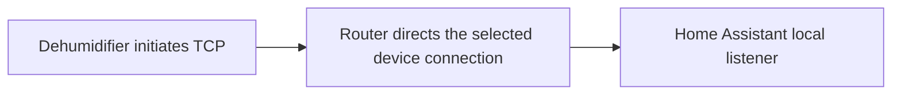

# Experimental local control

The experimental local profile accepts the dehumidifier's native inbound TCP connection in Home Assistant. It does not use the vendor account or forward commands through the cloud. The device must already be provisioned on Wi-Fi, and your network must direct its connection to the integration's listener.

**Build availability:** the 0.4.0 update decodes the appliance's own measured inlet/outlet sensors from its native status reports, and 0.3.1 keeps a consistent entity set across connections. Hardware evidence below was collected with 0.3.0; the entity-registration change and the decoder are validated in software. The v0.2.2 release contains only the cloud profile; installing that release will not add the local connection menu.

**A persistent local installation is now operating on one Lite-equipped Storm Pro.** It uses a reserved appliance address, device-scoped control and DNS redirection, a managed DNS service and a device WAN block. One final Home Assistant ON/OFF check received fresh matching device reports for both commands, retained continuous mode throughout and required no retries. This establishes the installed local control path; it does not establish long-term reliability or independent compressor/water-flow measurements.

**The profile remains experimental.** A temporary installation on one Lite-equipped Storm Pro retained its dehumidifier entity identity and confirmed display-unit changes, power ON/OFF and targets 50%/55% through device reports. Its continuous-mode request sent the valid native target 20 but timed out without a matching reply; subsequent reports retained target 55. OFF was then confirmed with that target still selected. The cause of the missed continuous-mode command remains unresolved.

Earlier standalone local endpoint trials confirmed power ON/OFF, display-unit changes and one warm TCP reconnect. A standalone ON → 50 → 55 → 20 → OFF trial also succeeded, restoring continuous mode before OFF. That earlier success does not resolve the later Home Assistant failure. Only numeric targets 50% and 55%, plus continuous 20, have been exercised locally; the HA profile implements the wider app-defined target range. A managed local DNS service has since been installed. Sustained offline drying, cold-start behavior and recovery across router/NAS restarts remain unverified.

## Available controls and evidence

| Capability | Experimental local profile | Evidence and limits |
| --- | --- | --- |
| Temperature display | Celsius/Fahrenheit select | Both standalone and Home Assistant trials completed Fahrenheit → Celsius → Fahrenheit with matching device reports. This changes display units, not a measured temperature sensor. |
| Power | Dehumidifier controls and a Power switch share the same coordinator; starting requires **Allow experimental local power-on**, off by default | Standalone and Home Assistant dehumidifier actions confirmed ON and OFF through matching reports. A power report does not measure compressor operation. |
| Freshness and sample time | Diagnostics for locally received reports | Device timestamps in the observed frames were zero; sample time records local receipt. |
| Last command | Command feedback diagnostic | Distinguishes a matched device report from an uncertain result; a queued command is not confirmation. |
| Target and continuous mode | Dehumidifier entity implements 25–80% targets in 5% steps and auto/continuous modes | Standalone 50 → 55 → 20 succeeded. Home Assistant confirmed 50%/55%, but its valid continuous request timed out and the reported target stayed 55. Reliability remains unresolved; other numeric targets are untested locally. Ordinary changes require fresh reported ON, rechecked at the native send boundary. |
| Measured humidity | Inlet and outlet relative humidity, and the dehumidifier's current humidity | Decoded from the appliance's native status reports (see [Protocol](PROTOCOL.md#status-data-layout-34-bytes)). The current humidity is the inlet reading, never the target. |
| Measured temperature and specific humidity | Inlet/outlet temperature and specific humidity, plus grains per pound, disabled by default | Decoded from the same native status reports (see [Protocol](PROTOCOL.md#status-data-layout-34-bytes)). |
| Faults, purge and locator | Registered but unavailable locally | The native fields/commands have not been validated for this profile. Absence of a fault entity does not mean the unit is fault-free. |

Both profiles register the same 24 entities, including optional diagnostics disabled by default. Fourteen now work locally: the dehumidifier and its current humidity, Power switch, Temperature display, Fresh device sample, Device sample time, Last command, and the measured Inlet and Outlet humidity, temperature, specific humidity and grains. The grains sensors are disabled by default. The other ten stay unavailable with `unavailable_reason: not_supported_by_local_connection`: Fault codes and the fault binary sensor, Draining and Defrosting, the Purge and Refresh buttons, the Locate switch, the specific-humidity display select, Reported working time and Coil temperature. None reports a cached cloud reading or accepts an unsupported action. Reconfiguring to cloud resumes supported cloud features through the same entity IDs. Version 0.3.0 registered only six local entities, and 0.4.0 added the eight measured ones. Temporary Home Assistant commissioning verified the retained dehumidifier entity ID and fresh local reports. Its scoped network rollback completed after confirmed OFF. The cloud entry was then restored and recovery verified through fresh cloud reports. Network rollback and restoring Home Assistant are separate steps.

The cloud profile retains its existing controls. See [Compatibility](COMPATIBILITY.md) for model/controller limits and [Protocol](PROTOCOL.md#experimental-local-tcp-transport) for the measured native contract.

## Network requirements

The unit initiates the connection. Entering its IP address does not make Home Assistant connect to a TCP server on the appliance. The tested Lite controller contacted TCP port **6100**; another model or firmware must be identified independently.

Prepare all of the following:

- A stable IPv4 address for the device and an explicit IPv4 bind address assigned to Home Assistant's runtime. The bind address is not the appliance address or the browser's Home Assistant URL. Wildcard binding is not accepted.
- A free TCP listening port, **6100** by default; the setup form accepts ports 1024–65535. Each local entry needs a listening address/port combination that is not already occupied.
- Router support for a narrowly scoped destination-NAT rule or an equivalent route that directs this device's identified outbound TCP connection to the Home Assistant listener. Determine the actual destination from your own device; this guide does not prescribe a vendor IP address or a universal router command.
- Firewall permission from the selected device to that listener and a working return path. The source IP arriving at Home Assistant must match the configured device IPv4; a proxy or source-NAT rule that replaces it with a gateway address will fail the identity check.
- Device-scoped DNS handling for the controller’s observed vendor hostname, so reconnecting does not require a vendor DNS answer. The installed arrangement uses a managed local resolver for that device, with an exact-hostname override and a matching DNS firewall permission. Keep DNS and listener services persistent; other firmware may use different destinations.
- An explicit way to remove the local routes and restore the original connection if commissioning fails. Existing established connections may not adopt a new route immediately; handle reconnection using your router's supported, device-scoped procedure.

Use your router's documentation for the rule and its rollback. The integration does not modify DNS, firewall rules, DHCP, Wi-Fi provisioning or appliance firmware. Do not apply a global hostname override as a substitute for identifying the device's connection: the same vendor hostname may serve other app traffic. DNS behavior on cold boot and future changes to the vendor destination are unverified.

Home Assistant's [Network configuration](https://www.home-assistant.io/integrations/network/) identifies network interfaces under **Settings → System → Network**; it does not create this router redirection. With Home Assistant Container, account for the runtime's network namespace: the official [Linux Container installation](https://www.home-assistant.io/installation/linux/#install-home-assistant-container) uses host networking. A different container or VM arrangement needs its own reachable listener configuration. Access to the web UI alone does not establish access to the device TCP port.

## Add a local entry

1. Install the integration using [Installation](INSTALL.md). HACS/manual packaging is the same for both profiles; repository visibility and HACS availability are unchanged.
2. Prepare the listener address, device address, port, complete Wi-Fi MAC and device-scoped routing/rollback plan above. Keep the unit in a known stopped state during initial setup.
3. Open **Settings → Devices & services → Add integration → ALORAIR Lite** and choose **Experimental local connection**.
4. Fill in **Home Assistant listening IPv4 address**, **Appliance IPv4 address**, **Listening TCP port** and **Device Wi-Fi MAC**. The listener accepts only that source address and exact native-frame identity. These checks do not provide cryptographic authentication.
5. Apply the prepared route and inspect **Fresh device sample**, **Device sample time** and the reported display selection. Completing the form or opening a socket does not prove an appliance connection. Valid matching device reports are required.
6. Leave local power starts disabled while validating the connection. A reversible display-unit change followed by restoration is the previously demonstrated command. Inspect the command diagnostic and subsequent reports.

The same device identity cannot be added again under a different profile. Use reconfiguration for an existing entry.

Local status is pushed by the device rather than cloud-polled. The profile marks status stale after 35 seconds without a fresh report, and the measured inlet/outlet values follow that same rule: they become unavailable rather than falling back to a cached cloud reading or the previous local value. This is an integration guard, not a verified reporting guarantee for all firmware. The sample timestamp represents local receipt, and a successful keepalive alone does not refresh a status measurement.

## Reconfigure an existing cloud entry

Use the existing integration entry's **Reconfigure** action and select **Experimental local connection**. Reconfiguration keeps that configuration entry and device identity, and replaces its cloud credentials with the local connection settings. It does not copy credentials into the local client, silently create a second device, or enable cloud fallback. Historical Home Assistant backups may still contain the previous credentials.

The local dehumidifier uses the same device-based unique identity as the cloud dehumidifier. Retention of its registered entity ID was observed during temporary Home Assistant commissioning. Its target and auto/continuous controls are implemented, and since 0.4.0 the measured inlet/outlet sensors report locally, so the card's current humidity is the inlet reading. Cloud fault, purge and locator entities remain unavailable locally. An automation that depends on those sensors or controls still needs review, and the unresolved continuous-mode failure prevents treating local control as ready for unattended use. Record the existing setup, make a backup, stop the unit normally, and inspect actual entity IDs and each dependent automation after changing transport.

To return to cloud operation, restore the original network path and reconfigure the same entry as **AlorAir-Lite cloud**, supplying the owning account credentials again. Verify a fresh cloud sample and the required entities before resuming dependent automations. Network rollback and Home Assistant reconfiguration are separate steps; neither happens automatically when the other fails.

## Experimental power and command feedback

**Allow experimental local power-on** (`allow_local_power`) is off by default in the local entry's options. Enabling it permits an ON request; it does not start the unit or validate the command on your model. Fresh status and restart protection still apply. OFF remains available on a verified connected session, including when status has become stale, so missing telemetry does not itself prevent a shutdown request. A disconnected listener cannot deliver either command.

The native client serializes commands, spaces writes and waits for a matching later status opcode/value. Its receive boundary excludes both partially parsed frames and complete reports already buffered before the command. A timeout or disconnection leaves delivery uncertain; commands are not automatically replayed after reconnect. An identical request during the original 300-second pending window raises an explicit error explaining that no retry was sent. Suppressed duplicates do not extend that window or turn uncertain feedback into success; wait for expiry and inspect fresh device status. Changing profiles, unloading the integration, or removing a route is not a stop command. The firmware retains its own operating and shutdown behavior.

The dehumidifier can request a numeric target or auto/continuous mode after fresh reported ON. The native target is exposed separately from the measured inlet humidity; continuous mode uses the special target 20 rather than a measured 20% RH value, and the target is never shown as a measurement. Auto uses the last observed numeric target or a valid target restored from Home Assistant's saved entity state, with a 50% fallback when neither exists. Restoring that saved preference sends no device command and does not fabricate a current target while waiting for reports. Standalone local changes to 50%, 55% and continuous mode have matching report confirmation. Home Assistant confirmed 50%/55%, but its continuous request received no matching report and timed out; the device continued reporting 55 until a confirmed OFF. Faults are not interpreted, and the command failure has no established firmware cause. These controls do not establish reliable autonomous drying or target accuracy on an untested controller.

## Troubleshooting and remaining work

| Symptom | Check |
| --- | --- |
| Listener cannot start | The bind address must exist inside Home Assistant's runtime and the port must be free. Check container/VM networking and the integration log. |
| Listener starts but no sample arrives | Confirm the exact device, observed destination/port, device-scoped route, allowed source IP and return path. A successful configuration form is not device discovery. |
| Device is rejected | Check the full Wi-Fi MAC and source IPv4. Another app family, address translation or a controller revision may use a different contract. |
| ON is rejected | Local power is disabled by default. Check the option, freshness and restart protection; do not rapidly retry uncertain commands. |
| Cloud app stops updating | The local route replaces the selected device connection. The local client does not forward cloud traffic or automatically fall back. |
| Fault, purge or locator entities are unavailable | These native fields and commands are not mapped. The entities stay registered and explain the limitation in `unavailable_reason`. The dehumidifier's target and mode do not supply fault status, and an absent fault entity does not mean the unit is fault-free. |
| A measured humidity or temperature reads unavailable or unknown | Since 0.4.0 these come from the native status reports. Check that a fresh report arrived within the last 35 seconds and that the listener still holds the device connection. A value failing its range or conversion check is left unknown rather than guessed. |
| Target or mode change is rejected | Wait for fresh reported ON before changing humidity. Only targets 25–80% in 5% steps, or the continuous-mode action, are accepted. |
| Continuous mode times out while the previous target remains reported | This occurred during Home Assistant commissioning despite a valid native request. Treat the result as uncertain and inspect subsequent reports. It is not evidence of a successful mode change; do not rapidly replay the command. |
| A repeated request reports uncertain previous delivery and no retry sent | The original request remains inside its 300-second pending window. The duplicate was blocked without sending another native command. Wait for expiry and inspect fresh status; expiry does not itself prove the earlier result. |

Remaining validation includes resolving the Home Assistant continuous-mode failure, repeated command reliability, other numeric humidity targets, sustained offline operation, cold boot, DNS/router/NAS restart recovery and destination changes, and the remaining unmapped native fields and controls. Standalone results, earlier temporary Home Assistant trials and the persistent installation are recorded separately in the [validation record](LIVE_VALIDATION.md#experimental-local-commissioning). Neither establishes complete internet independence for every firmware feature, unattended production readiness or compatibility with every Lite model.

Report the integration and Home Assistant versions, model/controller revision, selected profile and redacted error/diagnostic state. Keep MACs, IPs, account details, packet captures and network rules out of public reports. See [Security](SECURITY.md#experimental-local-transport).
