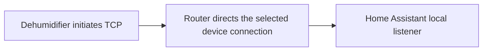

# Experimental local control

The experimental local profile accepts the dehumidifier's native inbound TCP connection in Home Assistant. It does not use the vendor account or forward commands through the cloud. The device must already be provisioned on Wi-Fi, and your network must direct its connection to the integration's listener.

**Build availability:** this guide describes the experimental local development change. The v0.2.2 release contains only the cloud profile; installing that release will not add the local connection menu.

**The HA profile remains experimental and has not yet been installed for appliance commissioning.** A standalone local endpoint has confirmed power ON/OFF, display-unit changes and one warm TCP reconnect on one Lite-equipped Storm Pro. A subsequent standalone local trial completed ON → 50 → 55 → 20 → OFF with matching reports on the same connection, restoring continuous mode before OFF. Only numeric targets 50% and 55%, plus continuous 20, have been exercised locally; the HA profile implements the wider app-defined target range. Sustained offline drying and cold-start behavior remain unverified.

## Available controls and evidence

| Capability | Experimental local profile | Evidence and limits |
| --- | --- | --- |
| Temperature display | Celsius/Fahrenheit select | A local endpoint completed Fahrenheit → Celsius → Fahrenheit with matching device reports. This changes display units, not a measured temperature sensor. |
| Power | Dehumidifier controls and a Power switch share the same coordinator; starting requires **Allow experimental local power-on**, off by default | A standalone local trial sent ON once and then OFF, with matching native reports for both. A power report does not measure compressor operation. |
| Freshness and sample time | Diagnostics for locally received reports | Device timestamps in the observed frames were zero; sample time records local receipt. |
| Last command | Command feedback diagnostic | Distinguishes a matched device report from an uncertain result; a queued command is not confirmation. |
| Target and continuous mode | Dehumidifier entity implements 25–80% targets in 5% steps and auto/continuous modes | Cloud wire mapping was followed by a standalone local ON → 50 → 55 → 20 → OFF trial with matching reports; 20 selects continuous mode. Other numeric targets are untested locally. Ordinary changes require fresh reported ON, rechecked at the native send boundary. |
| Measured humidity | Unknown | Intake/outlet humidity fields are not mapped. A target value is not measured room humidity. |
| Faults, purge and locator | Not exposed | The native fields/commands have not been validated for this profile. Absence of a fault entity does not mean the unit is fault-free. |

The local profile creates six entities: dehumidifier, Power switch, Temperature display, Fresh device sample, Device sample time and Last command. The power trial's temporary routing was removed cleanly, and Home Assistant subsequently showed fresh cloud OFF state. This verified recovery of the cloud installation, not live installation of the new HA profile.

The cloud profile retains its existing controls. See [Compatibility](COMPATIBILITY.md) for model/controller limits and [Protocol](PROTOCOL.md#experimental-local-tcp-transport) for the measured native contract.

## Network requirements

The unit initiates the connection. Entering its IP address does not make Home Assistant connect to a TCP server on the appliance. The tested Lite controller contacted TCP port **6100**; another model or firmware must be identified independently.

Prepare all of the following:

- A stable IPv4 address for the device and an explicit IPv4 bind address assigned to Home Assistant's runtime. The bind address is not the appliance address or the browser's Home Assistant URL. Wildcard binding is not accepted.
- A free TCP listening port, **6100** by default; the setup form accepts ports 1024–65535. Each local entry needs a listening address/port combination that is not already occupied.
- Router support for a narrowly scoped destination-NAT rule or an equivalent route that directs this device's identified outbound TCP connection to the Home Assistant listener. Determine the actual destination from your own device; this guide does not prescribe a vendor IP address or a universal router command.
- Firewall permission from the selected device to that listener and a working return path. The source IP arriving at Home Assistant must match the configured device IPv4; a proxy or source-NAT rule that replaces it with a gateway address will fail the identity check.
- An explicit way to remove the temporary route and restore the original connection if commissioning fails. Existing established connections may not adopt a new route immediately; handle reconnection using your router's supported, device-scoped procedure.

Use your router's documentation for the rule and its rollback. The integration does not modify DNS, firewall rules, DHCP, Wi-Fi provisioning or appliance firmware. Do not apply a global hostname override as a substitute for identifying the device's connection: the same vendor hostname may serve other app traffic. DNS behavior on cold boot and future changes to the vendor destination are unverified.

Home Assistant's [Network configuration](https://www.home-assistant.io/integrations/network/) identifies network interfaces under **Settings → System → Network**; it does not create this router redirection. With Home Assistant Container, account for the runtime's network namespace: the official [Linux Container installation](https://www.home-assistant.io/installation/linux/#install-home-assistant-container) uses host networking. A different container or VM arrangement needs its own reachable listener configuration. Access to the web UI alone does not establish access to the device TCP port.

## Add a local entry

1. Install the integration using [Installation](INSTALL.md). HACS/manual packaging is the same for both profiles; repository visibility and HACS availability are unchanged.
2. Prepare the listener address, device address, port, complete Wi-Fi MAC and device-scoped routing/rollback plan above. Keep the unit in a known stopped state during initial setup.
3. Open **Settings → Devices & services → Add integration → ALORAIR Lite** and choose **Experimental local connection**.
4. Fill in **Home Assistant listening IPv4 address**, **Appliance IPv4 address**, **Listening TCP port** and **Device Wi-Fi MAC**. The listener accepts only that source address and exact native-frame identity. These checks do not provide cryptographic authentication.
5. Apply the prepared route and inspect **Fresh device sample**, **Device sample time** and the reported display selection. Completing the form or opening a socket does not prove an appliance connection. Valid matching device reports are required.
6. Leave local power starts disabled while validating the connection. A reversible display-unit change followed by restoration is the previously demonstrated command. Inspect the command diagnostic and subsequent reports.

The same device identity cannot be added again under a different profile. Use reconfiguration for an existing entry.

Local status is pushed by the device rather than cloud-polled. The profile marks status stale after 35 seconds without a fresh report. This is an integration guard, not a verified reporting guarantee for all firmware. The sample timestamp represents local receipt, and a successful keepalive alone does not refresh a status measurement.

## Reconfigure an existing cloud entry

Use the existing integration entry's **Reconfigure** action and select **Experimental local connection**. Reconfiguration keeps that configuration entry and device identity, and replaces its cloud credentials with the local connection settings. It does not copy credentials into the local client, silently create a second device, or enable cloud fallback. Historical Home Assistant backups may still contain the previous credentials.

The local dehumidifier uses the same device-based unique identity as the cloud dehumidifier, allowing Home Assistant to retain its registered entity ID during reconfiguration. Its target and auto/continuous controls are implemented, but measured intake humidity remains unknown and cloud fault/purge/locator entities are absent locally. An automation that depends on those sensors or controls still needs review. Record the existing setup, make a backup, stop the unit normally, and inspect actual entity IDs and each dependent automation after changing transport.

To return to cloud operation, restore the original network path and reconfigure the same entry as **AlorAir-Lite cloud**, supplying the owning account credentials again. Verify a fresh cloud sample and the required entities before resuming dependent automations. Network rollback and Home Assistant reconfiguration are separate steps; neither happens automatically when the other fails.

## Experimental power and command feedback

**Allow experimental local power-on** (`allow_local_power`) is off by default in the local entry's options. Enabling it permits an ON request; it does not start the unit or validate the command on your model. Fresh status and restart protection still apply. OFF remains available on a verified connected session, including when status has become stale, so missing telemetry does not itself prevent a shutdown request. A disconnected listener cannot deliver either command.

The native client serializes commands, spaces writes and waits for a matching later status opcode/value. Its receive boundary excludes both partially parsed frames and complete reports already buffered before the command. A timeout or disconnection leaves delivery uncertain; commands are not automatically replayed after reconnect. Changing profiles, unloading the integration, or removing a route is not a stop command. The firmware retains its own operating and shutdown behavior.

The dehumidifier can request a numeric target or auto/continuous mode after fresh reported ON. The native target is exposed separately from measured humidity; continuous mode uses the special target 20 rather than a measured 20% RH value. Auto uses the last observed numeric target or a valid target restored from Home Assistant's saved entity state, with a 50% fallback when neither exists. Restoring that saved preference sends no device command and does not fabricate a current target while waiting for reports. Standalone local changes to 50%, 55% and continuous mode have matching report confirmation. The HA profile is still uncommissioned on hardware, and faults are not interpreted. These controls do not establish autonomous drying or target accuracy on an untested controller.

## Troubleshooting and remaining work

| Symptom | Check |
| --- | --- |
| Listener cannot start | The bind address must exist inside Home Assistant's runtime and the port must be free. Check container/VM networking and the integration log. |
| Listener starts but no sample arrives | Confirm the exact device, observed destination/port, device-scoped route, allowed source IP and return path. A successful configuration form is not device discovery. |
| Device is rejected | Check the full Wi-Fi MAC and source IPv4. Another app family, address translation or a controller revision may use a different contract. |
| ON is rejected | Local power is disabled by default. Check the option, freshness and restart protection; do not rapidly retry uncertain commands. |
| Cloud app stops updating | The local route replaces the selected device connection. The local client does not forward cloud traffic or automatically fall back. |
| Intake humidity is unknown, or fault/purge/locator entities are absent | These native measurements/controls are not mapped. The dehumidifier's target and mode do not supply measured humidity or fault status. |
| Target or mode change is rejected | Wait for fresh reported ON before changing humidity. Only targets 25–80% in 5% steps, or the continuous-mode action, are accepted. |

Remaining validation includes the Home Assistant profile on a real appliance, other numeric humidity targets, sustained offline operation, cold boot and address/DNS changes, and additional native measurements/controls. Confirmed standalone results cover power ON/OFF, targets 50%/55%, continuous-mode restoration, display changes and one warm reconnect on one already-provisioned unit. Independent capture analysis verified the humidity sequence, scoped rollback and fresh cloud OFF reports afterward; see the [validation record](LIVE_VALIDATION.md#experimental-local-commissioning). They do not establish complete internet independence for every firmware feature or compatibility with every Lite model.

Report the integration and Home Assistant versions, model/controller revision, selected profile and redacted error/diagnostic state. Keep MACs, IPs, account details, packet captures and network rules out of public reports. See [Security](SECURITY.md#experimental-local-transport).
